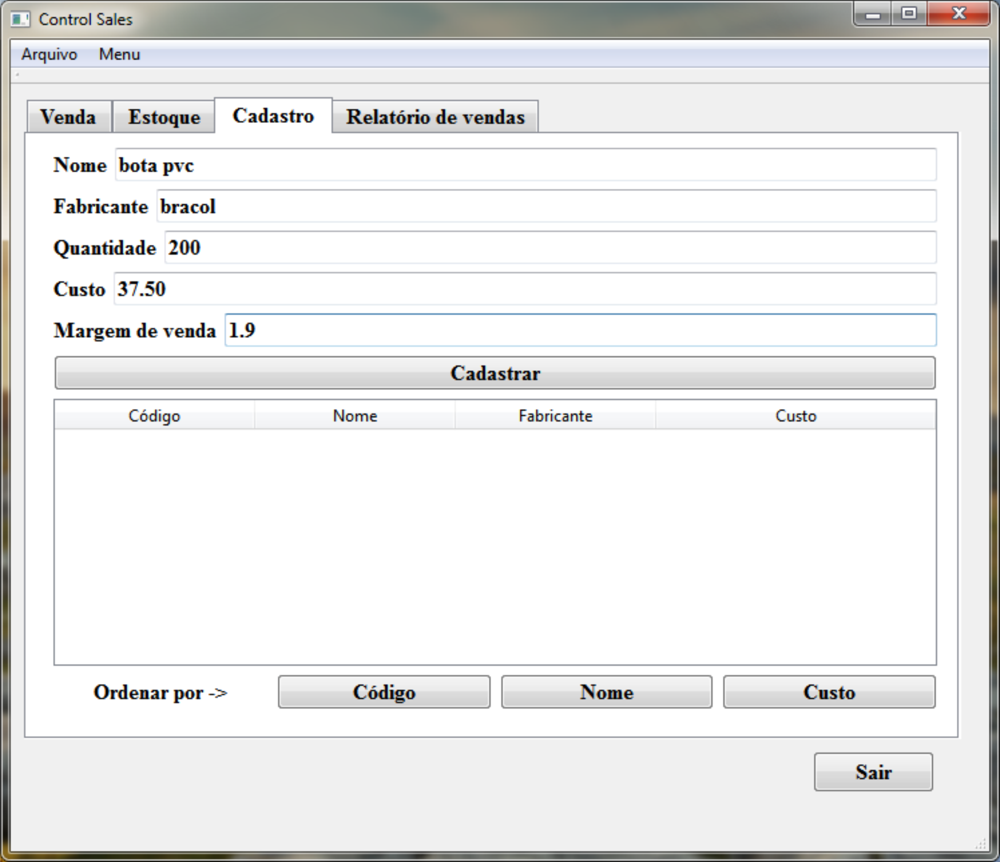
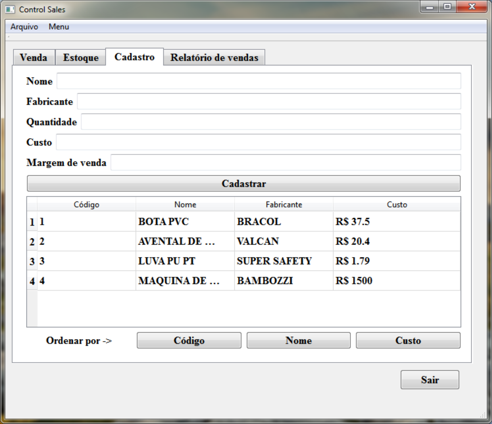

# Control-Sales

Software responsável por administrar entradas e saídas de produtos de uma loja.

**Introdução:**

  Seja bem vindo ao ControlSales. Este software foi criado para todos aqueles que trabalham com vendas e armazenamento de produtos em estoque.

##Cadastro de Produtos

  Com o Control Sales é possível cadastrar, os itens por nome, fabricante, valor de custo e quantidade.
  Para começar a utilizar o Control Sales, você deve cadastrar os seus produtos. Insira as informações no campos de edição na aba cadastro.
  

