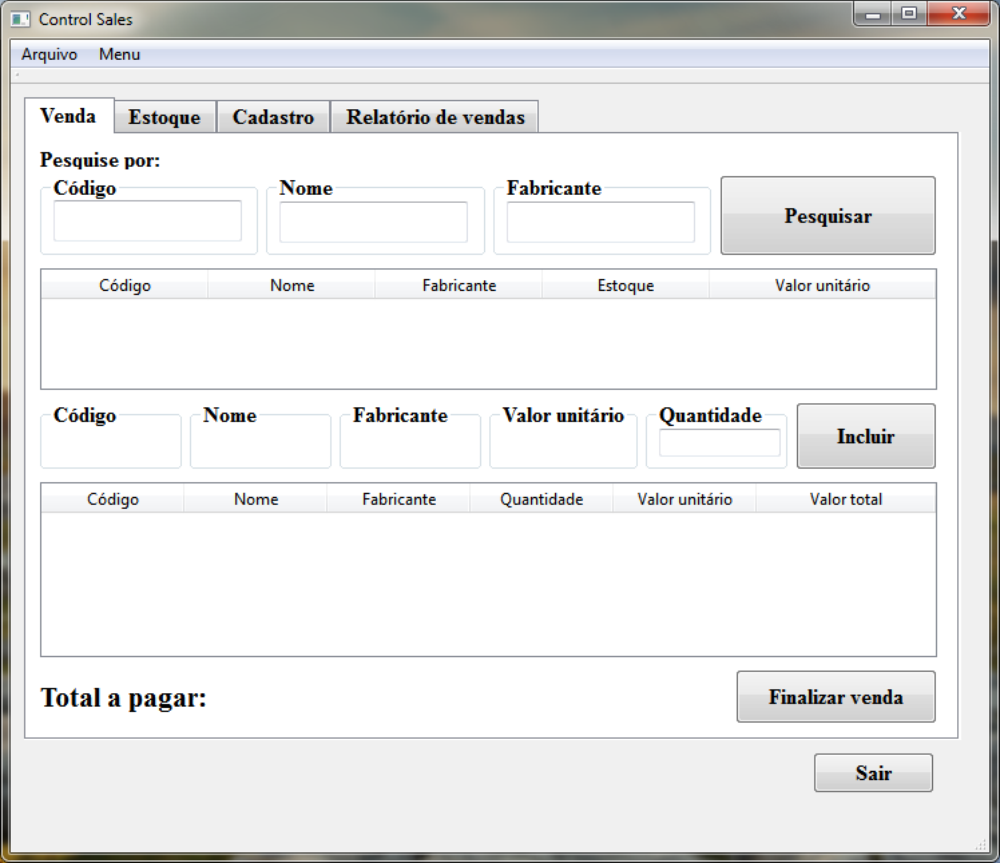

# Control-Sales

Software responsável por administrar entradas e saídas de produtos de uma loja.

Introdução:
-----------------

  Seja bem vindo ao ControlSales. Este software foi criado para todos aqueles que trabalham com vendas e armazenamento de produtos em estoque.

Cadastro de Produtos
---------------------
  Com o Control Sales é possível cadastrar, os itens por nome, fabricante, valor de custo e quantidade.
  Para começar a utilizar o Control Sales, você deve cadastrar os seus produtos. Insira as informações no campos de edição na aba cadastro.
  

Estoque
-------
  Logo após os itens serem cadastrados, você pode acessá-los na aba **Estoque**; onde está descrito todos os itens cadastrados e informando principalmente as quantidades atuais de cada produto armazenado.
  

Ordenação estoque
-----------------
  As principais opções contidas na aba **Estoque** são as ordenações dos produtos. Podendo organizar a visualização e procura dos materiais em estoque.
  

Ordenação cadastro
------------------
  Análogo à aba **Estoque**, na opção de **Cadastro** também se tem as funções de ordenação.

Vendas
------
  Para serem registradas as saidas mediante as suas vendas, cique na aba Venda.
 
 
 
 Nesta tela você irá registrar cada venda dos seus produtos. A principio, pesquise pelo pelo **Código, Nome ou Fabricante**; preenchendo uma das caixas de edição no inicio da tela. Logo após clique no botão **Pesquisar**.
 
 

Os itens pesquisados irão aparecer na primeira tabela; para ser confirmado a quantidade atual em estoque, o valor de venda do item, etc.

Confirmando item
----------------
Para acrescentar o item à lista de compras de seu cliente, clique 2 vezes em cima do **"Código, Nome, Fabricante, Estoque ou valor unitário"** do produto anteriormente pesquisado e inserido na tabela de conferência.

Irá aparecer uma pequena janela de confirmação. Se tudo estiver correto com o item escolhido, clique em **"Yes"**, do contrário **"No"**.

Inserindo Quantidades
----------------------
Será pedido, antes de confirmar a inserção do item na lista de compras, para informar a quantidade desejada do item.

Inserindo Itens na lista de venda
---------------------------------
Para confirmar a inserção do item com a quantidade desejada por seu cliente clique em **"Inserir"**.

Finalizando a Venda
-------------------
Para encerrar a venda, confirme os itens descritos na tabela gerada com a inserção dos ites, será mostrado o valor total à pagar na parte de baixo da tela. Clique em **"Finalizar venda"**.

Relatório de vendas
-------------------
Para consultar como foram suas vendas no dia, clique na aba **"Relatório de vendas"**. Onde será mostrado o total de vendas, custos, lucros, média dos lucros por item e média dos lucros por item.

##Salvando / Exportando | Abrindo / Importanto

Salvar
--------
No menu **Arquivo** você encontrará duas opções: Abrir e Salvar.

Clique em **Salvar**, para armazenar em um arquivo **".csv"** todos os dados cadastratos, realizando um backup.

Abrir
-----
No menu **"Arquivo"** clique em abrir. Selecione o arquivo de extenção **".csv"** desejado e clique em abrir para importar todos os dados de seu estoque anteriormente salvo.

